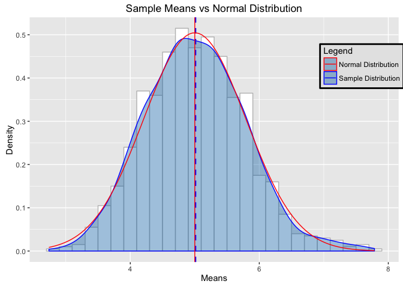

# Statistical Inference Course Project 1
Chuk Yong  
5 September 2016  
## Coursera Statistical Inference Course Project Part 1: Simulation Exercise

Instructions
In this project you will investigate the exponential distribution in R and compare it with the Central Limit Theorem. The exponential distribution can be simulated in R with rexp(n, lambda) where lambda is the rate parameter. The mean of exponential distribution is 1/lambda and the standard deviation is also 1/lambda. Set lambda = 0.2 for all of the simulations. You will investigate the distribution of averages of 40 exponentials. Note that you will need to do a thousand simulations.

Illustrate via simulation and associated explanatory text the properties of the distribution of the mean of 40 exponentials. You should

1. Show the sample mean and compare it to the theoretical mean of the distribution.
2. Show how variable the sample is (via variance) and compare it to the theoretical variance of the distribution.
3. Show that the distribution is approximately normal.
In point 3, focus on the difference between the distribution of a large collection of random exponentials and the distribution of a large collection of averages of 40 exponentials.

Set the parameters for our sample

```r
set.seed(123)
nSim <- 1000 # number of simulations
n <- 40 # sample size
lambda <- 0.2 # lambda for the exponential distribution
```
Generate 1000 simulations, each with 40 samples

```r
# generate n*nSim number of random number
data <- rexp(n*nSim, lambda)  
dataMatrix <- matrix(ncol = n, data) # put them in a matrix
```
Caculate the mean and variance of the 1000 simulation

```r
# calculate the mean of each row and put them in data frame for ggplot
sampleMean <- data.frame(sampleMean = apply(dataMatrix, 1,mean))
# calculate the mean and variance
mean_sampleMean <- mean(sampleMean$sampleMean)
var_sampleMean <- var(sampleMean$sampleMean)
```
Calculate the mean and variance of Normal Distribution 

```r
# for the theoretical mean, std and variance
meanTheo <- 1/lambda
stdTheo <- (1/lambda)/sqrt(n)
varTheo <- stdTheo^2
```
Print out the mean and variance of Simulation and Normal for comparison

```r
#Companring sample and theoretical mean, variance
cat("Sample Mean:", mean_sampleMean, "\nTheoretical Mean:",meanTheo)
```

```
## Sample Mean: 5.011911 
## Theoretical Mean: 5
```

```r
cat("Sample Variance:", var_sampleMean, "\nTheoretical Variance:", varTheo )
```

```
## Sample Variance: 0.6088292 
## Theoretical Variance: 0.625
```
As we can see, the mean and variance of the simluation are very close to that of a Normal Distribution.  That anwer the question 1 & 2 and also confirms the Central Limit Theorem.


<!-- -->

